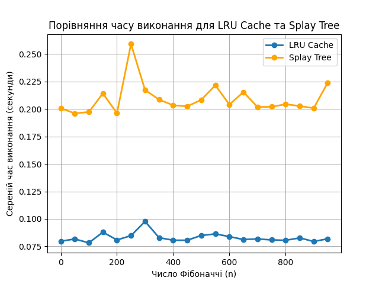

# Algorithms 2 Homework 7

### Task 1
Результат

```
Час виконання без кешування: 44.78503203392029 секунд
Час виконання з LRU-кешем: 46.7107253074646 секунд
```

З урахуванням того, що запити генеруються випадково
у діапазоні від 0 до 100 000, вірогідність генерації
дублікатів доволі мала, тому у даному випадку
використання кешу не дає великої переваги і спричиняє
виконання більшої кількості операцій, а отже
і потребує більше часу на виконання.

### Task 2
Результат
```  
n    LRU Cache Time (s)    Splay Tree Time (s)
---  --------------------  ---------------------
  0             0.0797318               0.200727
 50             0.0816881               0.196109
100             0.0782323               0.197298
150             0.087905                0.214227
200             0.0808556               0.196162
250             0.0847425               0.259192
300             0.0977002               0.217355
350             0.0829156               0.208587
400             0.0805773               0.203439
450             0.0805713               0.202486
500             0.0849201               0.208386
550             0.0863162               0.221692
600             0.0839207               0.204081
650             0.0812506               0.215484
700             0.0817619               0.201904
750             0.0808734               0.202061
800             0.080505                0.20439
850             0.0827068               0.202789
900             0.0794694               0.200788
950             0.0818725               0.224023
```


За результатами можна зробити висновок, що підхід LRU Cache 
є ефективнішим при обчисленні чисел Фібоначчі при великих значеннях n